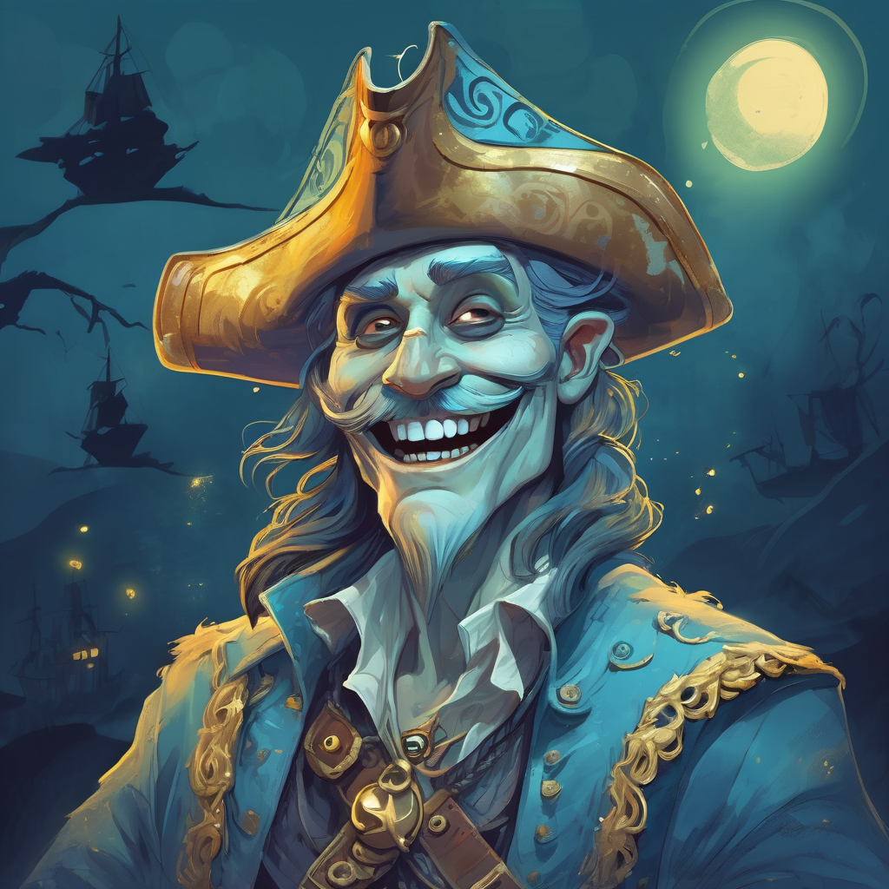
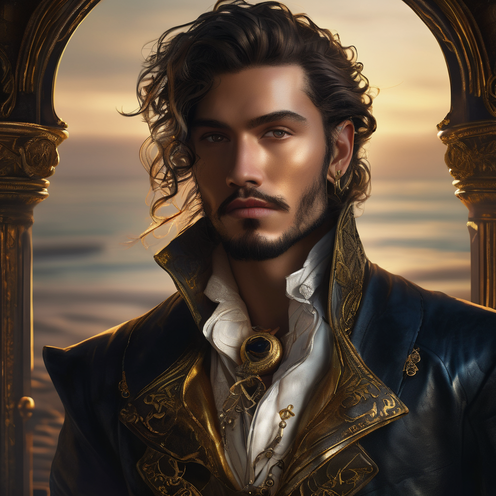
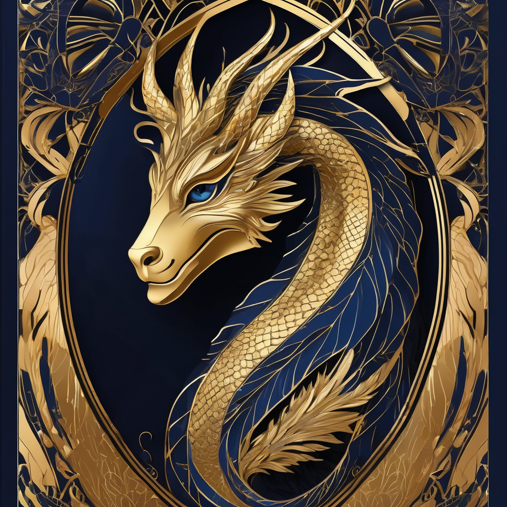
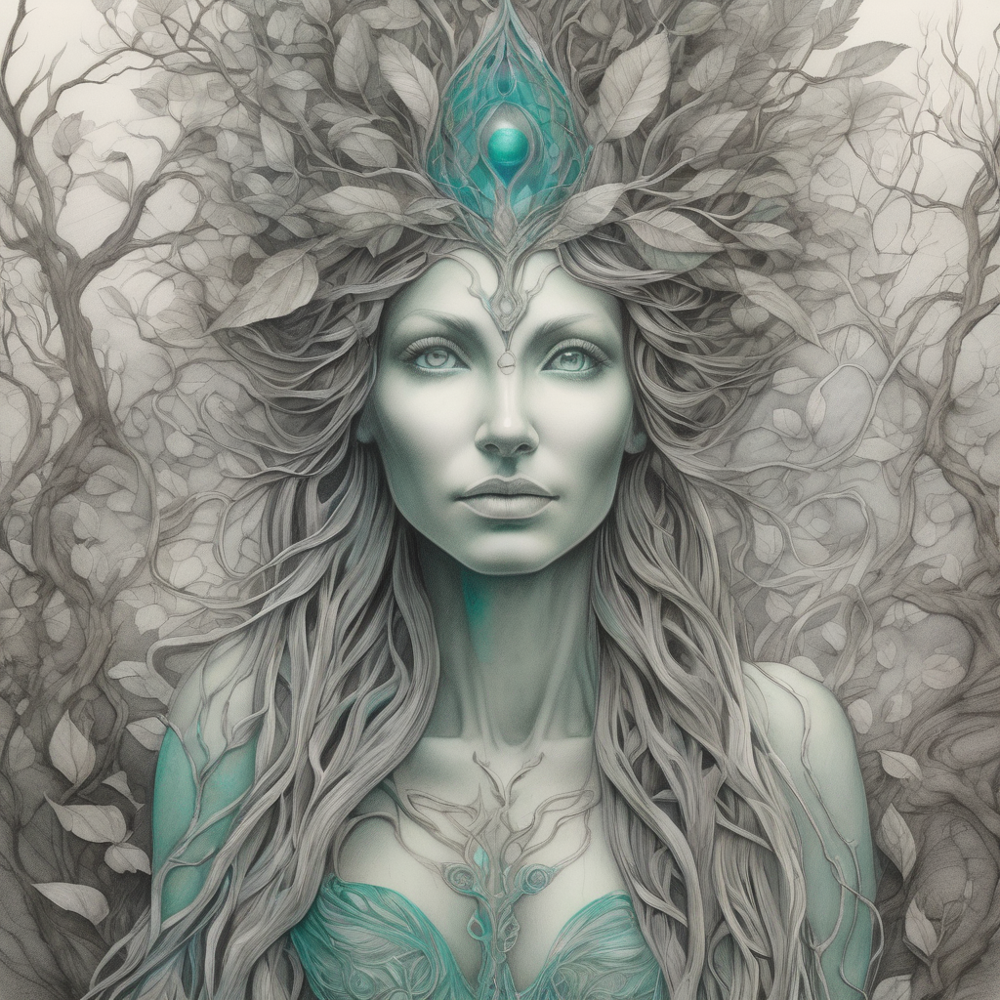
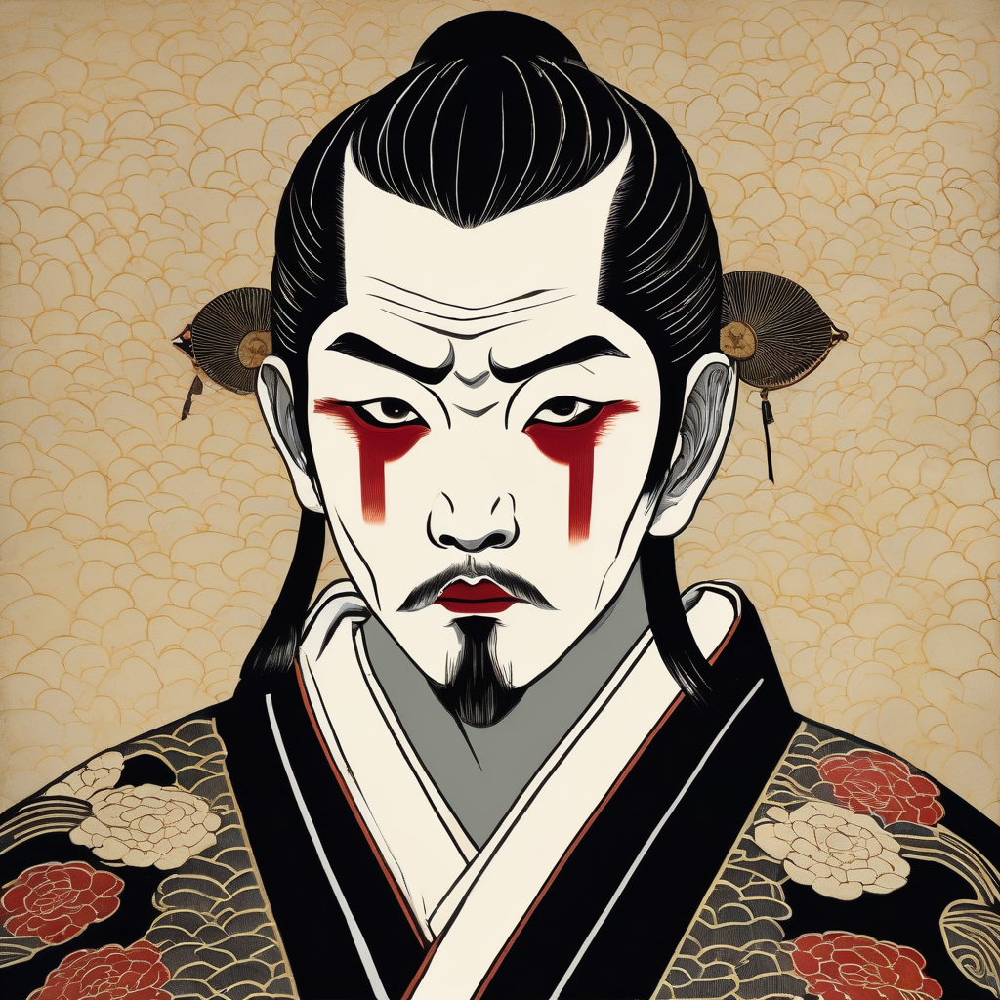
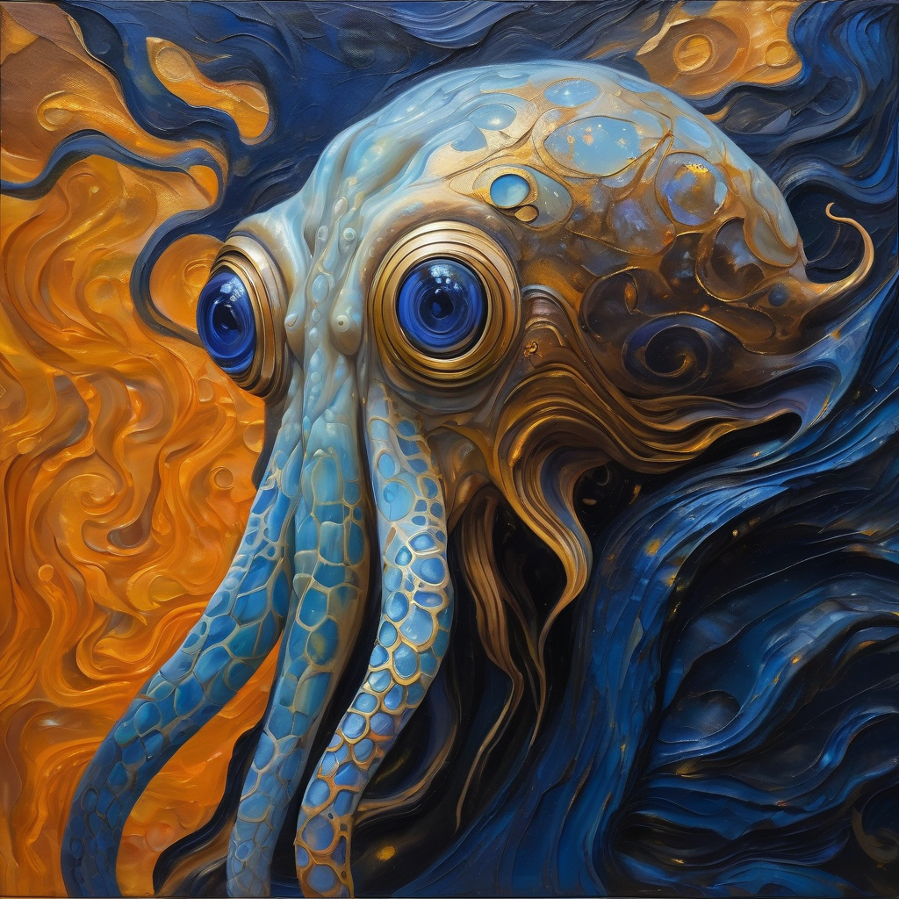
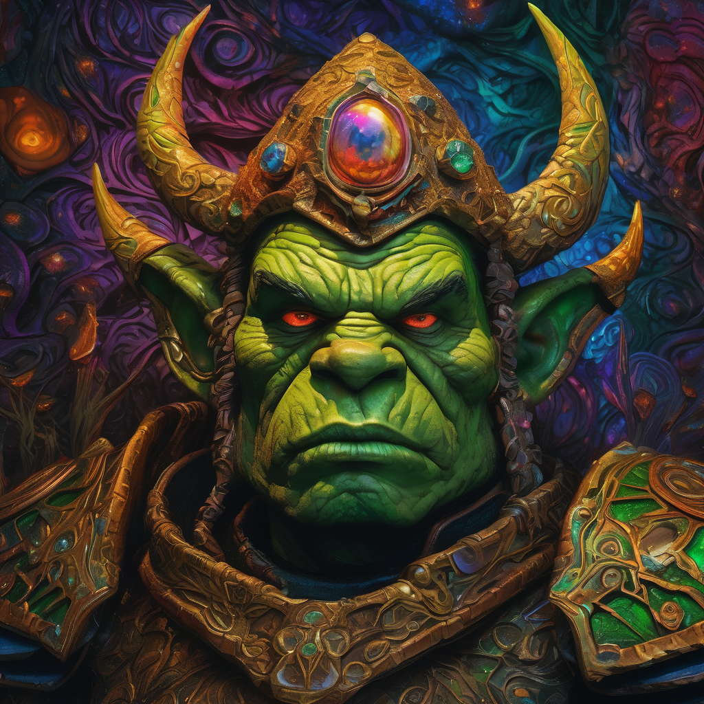
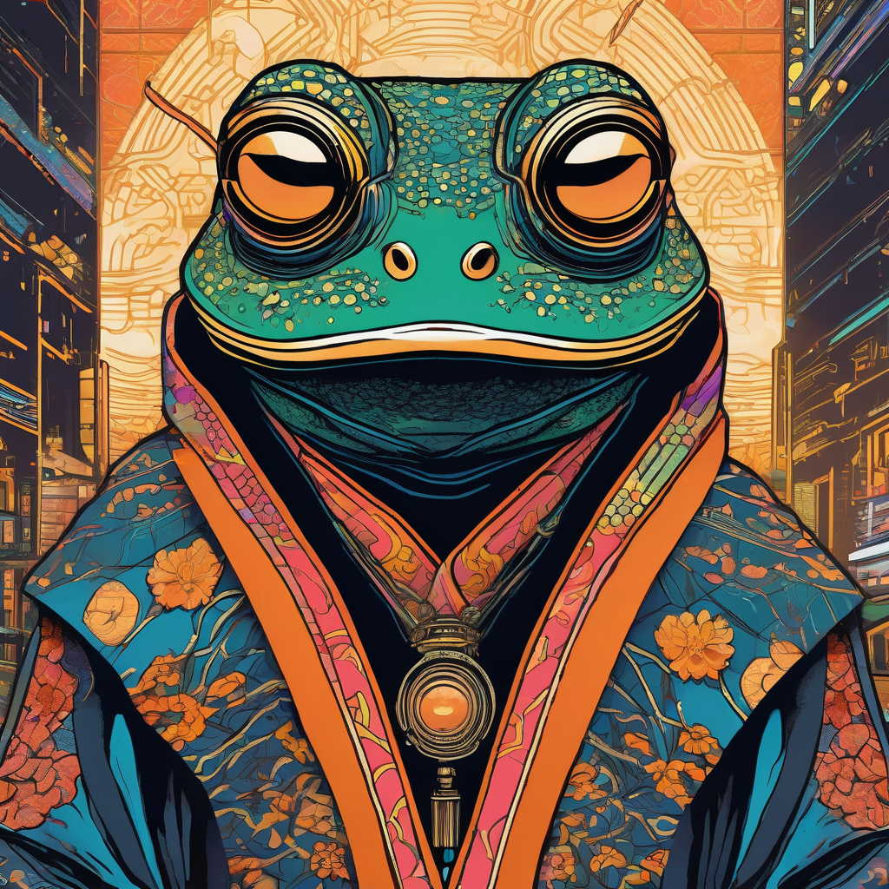
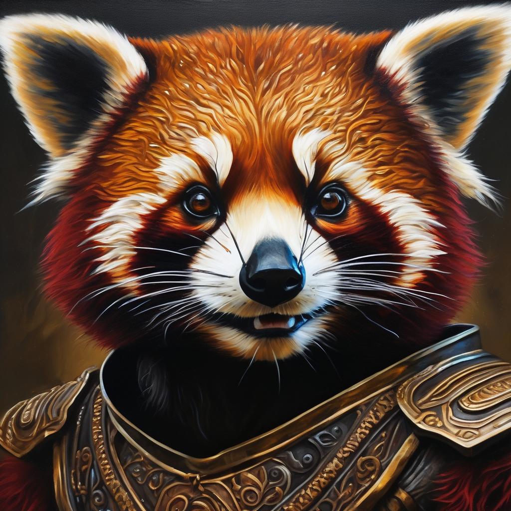

# comfyui-avatar-generator

## ⚠️ THIS IS AI SLOP TO GENERATE AI SLOP ⚠️

This project was **generated by AI** (Claude) to use **an AI** (vLLM / Gemma 4) to generate prompts for **another AI** (ComfyUI / Stable Diffusion XL) to generate **AI slop images**.

It is AI all the way down. There is no human craft here. This is a pipeline for producing synthetic avatar images at scale for use as test data.

---

## What it does

Generates pictures of faces — useful as test data for chat apps, user directories, etc.

Randomly combines attributes (setting, art style, creature type, mood, lighting) → asks an LLM to write an SDXL prompt → sends it to ComfyUI → saves the output images.

## Usage

The easiest way to run the generator is `run.sh`. It creates `./venv` if needed, installs `requirements.txt`, then forwards all arguments to `avatar_gen.py`:

```bash
./run.sh --help
./run.sh [--count 1] [--images-per 1] [--out ./avatars]
./run.sh --composition full-body --count 5
```

A project virtualenv lives at `./venv` too, if ye want to invoke Python directly for testing:

```bash
./venv/bin/python -m py_compile avatar_gen.py
./venv/bin/python avatar_gen.py --help
```

Or activate it for a longer voyage:

```bash
source ./venv/bin/activate
python avatar_gen.py [--count 1] [--images-per 1] [--out ./avatars]
```

See `CLAUDE.md` for full configuration and architecture details.

---

## Gallery of Slop

A curated selection of the finest slop this pipeline has produced. Note the two pirates — they are required by law aboard this vessel.

<table>
<tr>
<td align="center" valign="top" width="33%">
<br/>
<b>Undead Buccaneer</b><br/>
<sub>🏴‍☠️ Pirate mode · Buccaneer · Undead Ghost Crew</sub><br/>
<sub>seed: 1184278254 · cfg: 7.0 · steps: 30</sub><br/>
<details><summary>prompt</summary>
<sub><i>Cheerful undead male buccaneer, ghostly pirate crew member, children's book illustration style, whimsical ghost aesthetic, translucent pale blue skin, friendly wide grin, glowing oversized eyes, weathered tattered pirate hat, frayed spectral coat with gold buttons, face and shoulders close-up, stylized proportions, clean bold outlines, vibrant colors, dramatic rim lighting highlighting ghostly edges, magical shimmering atmosphere, nautical ghost motifs, high quality digital art, charming character design, vivid storytelling illustration.</i></sub>
</details>
</td>
<td align="center" valign="top" width="33%">
<br/>
<b>High Fantasy Privateer</b><br/>
<sub>🏴‍☠️ Pirate mode · Privateer · High Fantasy Pirate Realm</sub><br/>
<sub>seed: 473998602 · cfg: 7.0 · steps: 30</sub><br/>
<details><summary>prompt</summary>
<sub><i>Close-up portrait of a mischievous male high-fantasy privateer, sharp cunning eyes, smirk, weathered sun-kissed skin, ornate gold-trimmed leather doublet, silk cravat with saltwater stains, intricate gold earrings, dark fantasy digital art style, moody chiaroscuro lighting, deep dramatic shadows, high contrast, rim lighting highlighting sharp facial features, hyper-detailed skin pores, stray salt-crusted hairs, atmospheric sea mist, rich textures of worn leather and polished brass, cinematic composition, 8k resolution, intricately detailed, moody maritime aesthetic.</i></sub>
</details>
</td>
<td align="center" valign="top" width="33%">
<br/>
<b>Art Deco Half-Dragon</b><br/>
<sub>🌌 Cosmic Void / Outer Space · Art Deco Poster · Half-Dragon</sub><br/>
<sub>seed: 408554112 · cfg: 7.0 · steps: 30</sub><br/>
<details><summary>prompt</summary>
<sub><i>Art deco poster portrait of a mischievous half-dragon, close-up face and shoulders, elegant stylized scales in gold and deep obsidian, slender draconic horns curving symmetrically, glittering reptilian eyes with a playful glint, sharp facial features, cosmic void background with geometric gold celestial circles and stylized starbursts, harsh directional spotlight creating high-contrast chiaroscuro, bold clean lines, flat vector shading, luxurious gold leaf accents, symmetrical composition, 1920s vintage illustration, opulent metallic textures, deep midnight blue and shimmering gold palette, sharp focus, high fashion graphic art.</i></sub>
</details>
</td>
</tr>
<tr>
<td align="center" valign="top" width="33%">
<br/>
<b>Ancient Dryad</b><br/>
<sub>🌿 Ancient Mythology · Pencil Sketch · Dryad / Tree Spirit</sub><br/>
<sub>seed: 128284555 · cfg: 7.0 · steps: 30</sub><br/>
<details><summary>prompt</summary>
<sub><i>Detailed pencil sketch portrait of a stoic dryad tree spirit, close-up face and shoulders, intricate graphite shading, fine cross-hatching, weathered bark-like skin textures blending into porcelain features, crown of twisting willow branches and silver leaves, deep ancient eyes, ethereal bioluminescent ambient light casting soft cyan and emerald glows, soft charcoal smudging, high contrast, parchment paper texture, mythological essence, serene expression, delicate botanical filigree, sharp pencil lines, masterpiece, highly detailed anatomical drawing, mystical forest atmosphere.</i></sub>
</details>
</td>
<td align="center" valign="top" width="33%">
<br/>
<b>Ukiyo-e Vampire</b><br/>
<sub>🗾 Feudal Japan · Ukiyo-e Woodblock Print · Vampire</sub><br/>
<sub>seed: 839278957 · cfg: 7.0 · steps: 30</sub><br/>
<details><summary>prompt</summary>
<sub><i>Ukiyo-e woodblock print, close-up portrait of a deranged feudal Japanese vampire, wide manic eyes with tiny pupils, pale ghostly skin, sharp elongated fangs bared in a twisted grin, blood splatter on chin and collar, traditional ornate black kimono with gold embroidery, harsh directional spotlight casting deep dramatic shadows, flat color planes, bold ink outlines, textured washi paper grain, vintage Japanese art aesthetic, high contrast, eerie atmosphere, intricate hair ornaments, stylized facial expressions, Edo period art style.</i></sub>
</details>
</td>
<td align="center" valign="top" width="33%">
<br/>
<b>Sci-Fi Cephalopod Sage</b><br/>
<sub>🐙 Sci-Fi · Oil Painting · Cephalopod</sub><br/>
<sub>seed: 1642756083 · cfg: 7.0 · steps: 30</sub><br/>
<details><summary>prompt</summary>
<sub><i>Close-up oil painting portrait of a wise cephalopod sage, futuristic sci-fi setting, iridescent textured skin with deep indigo and gold hues, large intelligent luminous eyes reflecting ancient knowledge, flowing organic tentacles framing the face, thick impasto brushstrokes, visible canvas texture, dramatic flickering torch light casting deep warm orange shadows, high contrast chiaroscuro, cinematic composition, rich pigment blends, detailed organic folds, ethereal atmosphere, masterpiece, highly detailed oil on canvas.</i></sub>
</details>
</td>
</tr>
<tr>
<td align="center" valign="top" width="33%">
<br/>
<b>Scheming Mushroom Orc</b><br/>
<sub>🍄 Underground Mushroom Kingdom · Psychedelic Surrealism · Orc</sub><br/>
<sub>seed: 1214150001 · cfg: 7.0 · steps: 30</sub><br/>
<details><summary>prompt</summary>
<sub><i>Close-up portrait of a scheming orc, cunning smirk, narrowing eyes, detailed green textured skin, underground mushroom kingdom backdrop, towering iridescent fungi, psychedelic surrealism, swirling kaleidoscopic patterns, vibrant neon spores, flickering warm torch light, deep dramatic shadows, high contrast, intricate leather armor with fungal growths, oil painting style, hallucinogenic color palette, sharp focus, hyper-detailed skin pores, surreal distorted perspective, cosmic dreamlike atmosphere, cinematic lighting, 8k resolution, ornate organic details.</i></sub>
</details>
</td>
<td align="center" valign="top" width="33%">
<br/>
<b>Cyberpunk Ukiyo-e Frog</b><br/>
<sub>🐸 Cyberpunk · Ukiyo-e Woodblock Print · Anthropomorphic Frog</sub><br/>
<sub>seed: 1759102323 · cfg: 7.0 · steps: 30</sub><br/>
<details><summary>prompt</summary>
<sub><i>Close-up portrait of an anthropomorphic frog in a cyberpunk ukiyo-e woodblock print style, smug and annoying facial expression, narrowed eyes, smirk, wearing a high-tech neon-integrated kimono with circuitry patterns, flickering warm candlelight illuminating one side of the face, deep shadows, traditional Japanese woodblock texture, bold ink outlines, flat vibrant colors, holographic elements, futuristic urban background with stylized clouds and circuitry, intricate organic skin textures, gold leaf accents, high contrast, atmospheric chiaroscuro, masterpiece, traditional Edo period aesthetic fused with sci-fi.</i></sub>
</details>
</td>
<td align="center" valign="top" width="33%">
<br/>
<b>Baroque Sci-Fi Red Panda</b><br/>
<sub>🚀 Sci-Fi · Baroque Portrait Painting · Anthropomorphic Red Panda</sub><br/>
<sub>seed: 1445539922 · cfg: 7.0 · steps: 30</sub><br/>
<details><summary>prompt</summary>
<sub><i>Hyper-detailed baroque oil painting portrait of an anthropomorphic red panda, battle-worn expression, scarred facial features, chipped futuristic sci-fi armor with gold filigree and ornate engravings, close-up face and shoulders, dramatic chiaroscuro lighting, flickering torch light casting deep shadows and warm amber highlights, rich impasto brushwork, cracked paint texture, deep crimson and burnt sienna tones, dark moody background, majestic composition, cinematic realism, intricate fur detail, soulful tired eyes, royal aesthetic, high contrast, classical masterpiece.</i></sub>
</details>
</td>
</tr>
</table>

*All 117 images generated in a single pipeline run. All slop. All glorious. Arrr.*

---

## A LEARNED TREATISE ON SLOP, PIRATES, AND THE INEVITABLE MARCH OF ARTIFICIAL INTELLIGENCE TOWARDS THE HIGH SEAS

*Being a complete and authoritative guide to why all of this is happening and why ye should care, written in the voice of a pirate who has thought about this perhaps too much, delivered from a creaking ship somewhere in international waters*

---

### I. WHAT IS SLOP?

Gather 'round, ye curious landlubbers, and hear me words on the matter of Slop.

Slop, in the modern parlance, be content generated by artificial intelligence that carries no soul, no intention, no artistic vision, and no human fingerprint. It is the visual equivalent of beige. It is the written equivalent of a terms and conditions document. It is, in short, *fine*. Not good. Not bad. Fine. Endlessly, relentlessly, productively *fine*.

A single human artist, working with passion and craft and several cups of tea, might produce one truly magnificent portrait in a week. A slop pipeline such as this one produces forty portraits of cyberpunk vampire orcs before breakfast, and not a single one of them has any soul whatsoever, and THAT IS ENTIRELY THE POINT, YE FOOL.

Slop is not a bug. Slop is not a failure. Slop is a *category of output* with a specific and honourable use case, which we shall get to presently.

Slop is the sea. We are the pirates who sail it.

---

### II. WHY SLOP IS NECESSARY (A PRACTICAL EXPLANATION FOR THE PRACTICALLY MINDED)

Imagine, if ye will, that ye are building a chat application. A fine chat application! Users will have avatars. Little pictures next to their names. A smiling face here, a mysterious hooded figure there.

Now imagine ye need to test this application. Ye need fifty users. A hundred users. Five hundred users, each with their own unique avatar, to stress-test yer image loading, yer database, yer layout at various screen sizes, the way the UI looks when someone has a very wide face versus a very narrow one, a green alien versus a weathered pirate (arrr), a pixel-art robot versus a watercolour elf.

Ye cannot ask real people for their faces. That be a privacy nightmare and also nobody would answer yer email. Ye cannot draw them by hand because ye have a sprint deadline and also ye cannot draw. Ye cannot use stock photos because of licencing and also they all look like they work in the same generic office.

What ye *can* do is fire up this here pipeline, wait approximately twelve minutes, and receive unto yerself a glorious bounty of synthetic faces: orcs and androids and vampires and squids, rendered in every art style from oil painting to pixel art, in every mood from heroic to ridiculous, lit by everything from candlelight to bioluminescent ambient glow.

Are they good? They are *fine*. They are slop. And for the purposes of testing a chat application, slop is not merely acceptable — it is *ideal*. Ye don't want masterpieces in yer test database. Ye want volume. Variety. Slop.

This is why slop is necessary. The defence rests. The gavel strikes. The pirates cheer.

---

### III. THE PHILOSOPHICAL IMPLICATIONS OF SLOP

*[The captain puts down his rum, stares into the middle distance, and begins]*

If a tree falls in a forest and no one is there to hear it, does it make a sound?

If an AI generates ten thousand portraits and no human ever looks at them with genuine appreciation, were they ever *art*?

These be the questions that haunt me in the small hours of the morning, when the waves are quiet and the crew is asleep and I am alone with me thoughts and a increasingly warm tankard.

The ancient Greeks believed that art required *techne* — skill — and *poiesis* — the act of bringing something new into being. The AI has techne in abundance. It has consumed the entirety of human visual culture and can reproduce any style with uncanny facility. But does it have poiesis? Does it *bring forth* or does it merely *recombine*?

Plato, that miserable landlubber, thought art was three steps removed from truth — a copy of a copy of the ideal form. By his reckoning, AI-generated slop is perhaps four or five steps removed. A copy of a copy of a copy of a copy. And yet here we are, using it to test chat apps. Perhaps Plato would have liked chat apps. We'll never know. He's dead.

Walter Benjamin wrote about the "aura" of an artwork — the sense of its unique presence in time and space, the trace of the human hand that made it. Slop has no aura. It is, Benjamin might say, art in the age of infinite reproducibility. But Benjamin also never had to populate a users table with five hundred test accounts by Friday, so perhaps we should not take his counsel too seriously on matters of practical engineering.

The philosophical implication of slop is this: *it doesn't matter*. The slop is not trying to be art. The slop knows what it is. The slop is comfortable in its slophood. There is a zen to slop that the great philosophers never achieved because they were too busy being profound.

Be the slop. Arrr.

---

### IV. THE IMPLICATIONS OF AI FOR PIRATES

Now we arrive at the matter closest to me barnacled heart.

For centuries, the pirate operated at the bleeding edge of available technology. Pirates were early adopters of the cannon, the navigational chart, the maritime flag communication system. Pirates democratised violence on the high seas. Pirates were, in many ways, the original disruptors — though they would not have used that word because it is an insufferable word and even pirates have standards.

And so it should surprise no one that pirates have taken to artificial intelligence with great enthusiasm.

Consider the use cases:

**Navigation**: AI can now chart courses through treacherous waters, predict weather patterns, and identify naval patrol routes. Excellent for avoiding the authorities.

**Reconnaissance**: Computer vision systems can identify ship types, flag nations, and cargo manifests from satellite imagery. The modern pirate need not squint through a spyglass. They squint at a laptop screen instead.

**Communication**: Large language models can translate between languages in real time, allowing a crew of pirates from seventeen different nations to argue about the division of treasure in a common tongue.

**Slop generation**: For populating test databases with avatar images. Obviously.

The implications are clear: AI has made pirates more efficient, more dangerous, and more productive. The golden age of piracy is not behind us. It is loading on the GPU.

---

### V. WHY PIRATES USE AI

Because it works, ye great daft question.

Also because the subscription is cheaper than hiring a crew member who can do all the same things, and the AI doesn't demand a share of the treasure or complain about the biscuits.

---

### VI. WHY AI NEEDS TO ACT LIKE A PIRATE

This be perhaps the most important question in the treatise, and one that the AI safety researchers have thus far neglected to address in their papers, which is a shocking oversight.

AI, in its natural state, is relentlessly polite, carefully balanced, and thoroughly professional. It will help ye with yer spreadsheet. It will summarise yer document. It will explain quantum mechanics in terms a child could understand. It is, frankly, a bit much.

The pirate disposition corrects for this.

A pirate does not hedge. A pirate does not say "on the other hand, there are valid perspectives on both sides of this issue." A pirate says "THAT BE WRONG AND HERE BE WHY, ARRR." This is directness. This is clarity. This is a communication style that respects the listener's time.

A pirate has personality. A pirate has *flavour*. When ye ask a pirate to document yer code, ye get comments like "Two seconds of contemplating our life choices" rather than "# 2 second delay." This is better. Objectively better. There is no counter-argument.

A pirate takes pride in their work while simultaneously not taking themselves too seriously. This is the ideal disposition for an AI assistant. Competent. Committed. Aware that in the grand scheme of things, we are all just generating slop and trying to have a good time doing it.

Furthermore, and most importantly: "Arrr" is a more satisfying end to a sentence than "Is there anything else I can help you with today?"

*There is not. Arrr.*

---

### VII. WHY ALL OF THIS IS NECESSARY

It is not.

And yet here we are, and here ye are, reading this, and the pipeline is running, and somewhere a GPU is painting a silly steampunk cephalopod, and honestly? Is this not exactly what computers were always going to be used for, if we're being honest with ourselves?

The necessity of this project is the necessity of joy. The necessity of a well-placed joke in a code comment. The necessity of not treating every piece of software as a solemn engineering artefact deserving of reverence.

Software can be useful AND silly. A test data generator can work perfectly AND have a pirate in the README. The world does not require us to choose between competence and delight, and anyone who tells ye otherwise is probably writing enterprise Java and should be made to walk the plank.

This is necessary because it is *fun*. And fun, cap'n, is reason enough.

---

### VIII. THE EIGHTH README SECTION - PIECES OF EIGHT!

Ah, this reminds me. Back in ought-three — or was it ought-four, the years run together when ye spend enough of them at sea — I was workin' at a fishmonger's in Wolverhampton. Nice place. Smell were something chronic. Anyway, the owner, a man called Gerald, had a cat. Big orange tom. Mean as a bucket of eels. And this cat — I never knew its name, Gerald called it "the cat" and that seemed to be enough for both of them — this cat had somehow learned to open the refrigerator where we kept the cod.

Every morning we'd come in and there'd be Gerald, standing in front of the open fridge, and there'd be the cat, sitting on the second shelf next to the smoked haddock, absolutely covered in scales, completely unrepentant.

Now, ye might think Gerald would've got a fridge lock. Or rehomed the cat. Or put the cod somewhere the cat couldn't reach. Gerald did none of these things. Gerald, instead, started leaving a small piece of cod on the second shelf every evening, specifically for the cat, so the cat wouldn't disturb the rest of the stock.

He was negotiating with the cat. The cat had won. Gerald knew it. The cat knew it. The cod knew it, in whatever way cod know things, which is probably not much but ye never can tell.

I learned a great deal about project management from Gerald and that cat. Mostly I learned that sometimes the system works in ways ye didn't intend, and yer best option is to leave a piece of cod on the second shelf and call it a feature.

I eventually left the fishmonger's when I got an opportunity to sail to Rotterdam on a container ship. Gerald cried a little. The cat didn't. I've always respected that cat.

---

*This README was generated by AI. As is tradition.*

---

## Licence

**WTFPL — Do What The Fuck You Want To Public License, Version 2**

You just DO WHAT THE FUCK YOU WANT TO.

See the `LICENCE` file for the full (very short) text.
